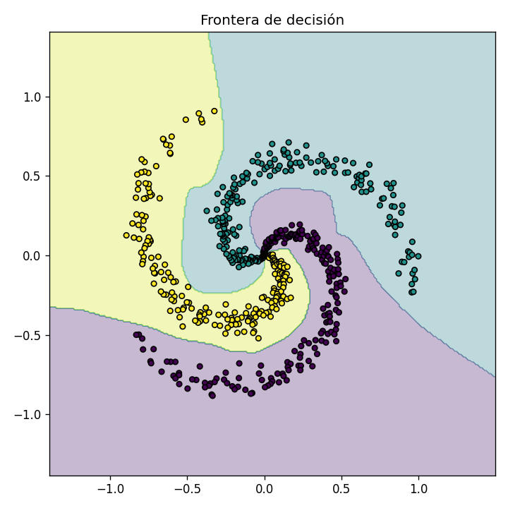
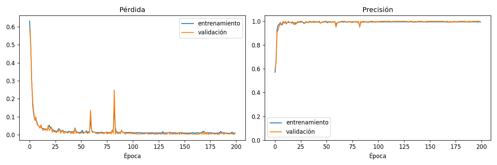

# red_neuronal

Red neuronal (perceptrón multicapa) implementada **desde cero con NumPy**, sin
frameworks como PyTorch o TensorFlow. Todo el proceso de aprendizaje es visible y
modificable: propagación hacia adelante, cálculo de la pérdida, retropropagación y
actualización de pesos.



## Características

- **Capas:** `Densa` (inicialización He/Xavier) y `Dropout`.
- **Activaciones:** `ReLU`, `LeakyReLU`, `Sigmoide`, `Tanh`.
- **Pérdidas:** error cuadrático medio (regresión), entropía cruzada binaria y
  entropía cruzada multiclase con softmax.
- **Optimizadores:** `SGD` con momento y `Adam`, ambos con regularización L2.
- **Entrenamiento:** mini-lotes, validación, parada temprana con restauración de
  los mejores pesos.
- **Datos:** XOR, espirales, círculos, carga de CSV propio, división
  entrenamiento/prueba y estandarización.
- **Herramientas:** CLI (`entrenar`, `evaluar`, `predecir`), guardado/carga en
  `.npz` y gráficas de entrenamiento.

## Requisitos

- Python 3.9 o superior.
- NumPy (se instala automáticamente). matplotlib es opcional, solo para gráficas.

## Instalación

```bash
python3 -m venv .venv
source .venv/bin/activate
pip install -e ".[dev]"        # incluye matplotlib y pytest
```

Para una instalación mínima usa `pip install -e .` (sin gráficas) o
`pip install -e ".[graficos]"` (con gráficas, sin pytest).

## Inicio rápido

```bash
red-neuronal entrenar --datos espiral --graficar resultados
```

Salida (resumida):

```
Datos: 480 de entrenamiento, 120 de prueba, 2 características
Arquitectura:
   0. Densa(entradas=2, salidas=64, inicializacion='he')      parámetros: 192
   1. ReLU()                                                  parámetros: 0
   2. Densa(entradas=64, salidas=64, inicializacion='he')     parámetros: 4160
   3. ReLU()                                                  parámetros: 0
   4. Densa(entradas=64, salidas=3, inicializacion='xavier')  parámetros: 195
  Pérdida: EntropiaCruzada
  Total de parámetros entrenables: 4547

Época    1/200 - pérdida: 0.6321 - precisión: 57.08% - val_pérdida: 0.5922 - val_precisión: 60.00%
Época   10/200 - pérdida: 0.0485 - precisión: 98.96% - val_pérdida: 0.0497 - val_precisión: 98.33%
...
Época  200/200 - pérdida: 0.0094 - precisión: 99.58% - val_pérdida: 0.0082 - val_precisión: 99.17%

Resultado en prueba - pérdida: 0.0082 - precisión: 99.17%
Gráfica guardada en resultados/historial.png
Gráfica guardada en resultados/frontera.png
```

### Cómo leer la salida

- **pérdida:** qué tan equivocada está la red en los datos de entrenamiento. Debe
  bajar con las épocas.
- **precisión:** porcentaje de aciertos en los datos de entrenamiento.
- **val_pérdida / val_precisión:** lo mismo, pero en datos que la red no usa para
  aprender. Indican si generaliza.
- **Resultado en prueba:** métrica final sobre esos datos no vistos.

Si la pérdida de entrenamiento sigue bajando pero la de validación sube, la red
está **sobreajustando** (memorizando). Prueba `--dropout 0.2`,
`--decaimiento-peso 0.0001` o `--paciencia 30`.



## Uso de la CLI

También se puede invocar como `python -m red_neuronal`. Cada comando acepta
`--help`.

### `entrenar`

```bash
# Espirales con parada temprana, guardando modelo y gráficas
red-neuronal entrenar --datos espiral --ocultas 64 64 --epocas 200 \
    --paciencia 40 --guardar modelos/espiral.npz --graficar resultados

# XOR: el problema clásico que una sola neurona no puede resolver
red-neuronal entrenar --datos xor --ocultas 8 --activacion tanh --lr 0.05 --lote 4

# Círculos concéntricos con SGD
red-neuronal entrenar --datos circulos --optimizador sgd --lr 0.05
```

Opciones de datos (comunes a `entrenar` y `evaluar`):

| Opción | Por defecto | Descripción |
| --- | --- | --- |
| `--datos` | `espiral` | `xor`, `espiral`, `circulos` o `csv` |
| `--csv` | | Ruta del CSV (con `--datos csv`) |
| `--objetivo` | `-1` | Columna a predecir: índice o nombre |
| `--tarea` | `clasificacion` | `clasificacion` o `regresion` |
| `--muestras` | `200` | Muestras por clase (datos sintéticos) |
| `--clases` | `3` | Número de clases (espiral) |
| `--ruido` | `0.2` | Ruido de los datos sintéticos |
| `--semilla` | `42` | Semilla para resultados reproducibles |

Opciones del modelo y del entrenamiento:

| Opción | Por defecto | Descripción |
| --- | --- | --- |
| `--ocultas` | `64 64` | Neuronas de cada capa oculta |
| `--activacion` | `relu` | `relu`, `leaky_relu`, `sigmoide`, `tanh` |
| `--dropout` | `0.0` | Fracción de neuronas apagadas al entrenar |
| `--optimizador` | `adam` | `adam` o `sgd` |
| `--lr` | `0.01` | Tasa de aprendizaje |
| `--momento` | `0.9` | Momento (solo SGD) |
| `--decaimiento-peso` | `0.0` | Regularización L2 |
| `--epocas` | `200` | Pasadas completas por los datos |
| `--lote` | `32` | Tamaño del mini-lote |
| `--paciencia` | | Épocas sin mejora antes de detenerse |
| `--prop-prueba` | `0.2` | Proporción reservada para prueba |
| `--cada` | `10` | Imprimir progreso cada N épocas |
| `--guardar` | | Archivo `.npz` donde guardar el modelo |
| `--graficar` | | Carpeta para `historial.png` y `frontera.png` |

### `evaluar`

Mide un modelo guardado sobre un conjunto de datos. Con otra semilla se generan
datos nuevos que la red nunca vio:

```bash
red-neuronal evaluar --modelo modelos/espiral.npz --datos espiral --semilla 7
```

### `predecir`

```bash
red-neuronal predecir --modelo modelos/espiral.npz --entrada 0.5,0.2 --entrada=-0.3,-0.6
```

```
[0.5, 0.2] -> clase 0 (confianza 81.24%)
[-0.3, -0.6] -> clase 0 (confianza 98.48%)
```

`--entrada` se puede repetir. Si el primer valor es negativo, usa la forma
`--entrada=-0.3,-0.6` para que no se confunda con una opción.

## Entrenar con tus propios datos (CSV)

El archivo debe tener encabezado y todas las columnas numéricas, excepto la
columna objetivo, que en clasificación puede ser texto:

```csv
largo,ancho,especie
5.1,3.5,setosa
7.0,3.2,versicolor
6.3,3.3,virginica
```

```bash
# Clasificación
red-neuronal entrenar --datos csv --csv flores.csv --objetivo especie \
    --guardar modelos/flores.npz

# Regresión (predecir un número)
red-neuronal entrenar --datos csv --csv casas.csv --objetivo precio \
    --tarea regresion --guardar modelos/casas.npz

# Predecir con valores sin normalizar: el modelo guarda la normalización
red-neuronal predecir --modelo modelos/flores.npz --entrada 6.0,3.0
```

Con CSV las características se estandarizan automáticamente (media 0,
desviación 1) y los parámetros se guardan dentro del modelo.

## Usar como librería

```python
from red_neuronal import Adam, EntropiaCruzada, RedNeuronal, crear_mlp, datos

X, y = datos.espiral(200, clases=3, semilla=0)
X_ent, X_pru, y_ent, y_pru = datos.dividir(X, y, semilla=0)

red = crear_mlp(2, [64, 64], 3, EntropiaCruzada(), Adam(0.01), semilla=0)
historial = red.entrenar(X_ent, y_ent, epocas=200, datos_validacion=(X_pru, y_pru), paciencia=40)

perdida, precision = red.evaluar(X_pru, y_pru)
print(f"precisión: {precision:.2%}")

red.guardar("modelos/espiral.npz")
red = RedNeuronal.cargar("modelos/espiral.npz")
print(red.predecir(X_pru[:3]))          # probabilidades por clase
print(red.predecir_clases(X_pru[:3]))   # clase más probable
```

En [`ejemplos/entrenar_espiral.py`](ejemplos/entrenar_espiral.py) se arma la red
capa por capa:

```bash
python ejemplos/entrenar_espiral.py
```

## Cómo funciona

Cada paso de entrenamiento sobre un mini-lote hace cuatro cosas:

1. **Adelante:** cada capa transforma su entrada. Una capa densa calcula
   `x @ W + b` y la activación introduce no linealidad (por ejemplo, ReLU).
2. **Pérdida:** compara la salida con el valor esperado (entropía cruzada para
   clasificación, error cuadrático medio para regresión).
3. **Atrás (retropropagación):** con la regla de la cadena, cada capa calcula
   cómo afecta cada peso a la pérdida, recorriendo la red de la salida a la
   entrada.
4. **Optimizador:** mueve cada peso un poco en la dirección que reduce la
   pérdida (SGD o Adam).

La explicación completa, con las fórmulas, derivaciones, diagramas y un ejemplo
numérico paso a paso, está en
[`docs/procedimiento.pdf`](docs/procedimiento.pdf) (fuente:
[`docs/procedimiento.md`](docs/procedimiento.md)). Para regenerar el PDF tras
editarlo se necesitan pandoc, tectonic (o xelatex) y Node.js:

```bash
./docs/generar_pdf.sh
```

Para extender la red, crea una subclase de `Capa` con `adelante`, `atras` y,
si tiene pesos, `parametros`. Las pruebas de `tests/test_gradientes.py`
comparan la retropropagación con gradientes numéricos y sirven para validar
capas nuevas.

## Estructura del proyecto

```
src/red_neuronal/
  capas.py          Capa base, Densa, Dropout
  activaciones.py   ReLU, LeakyReLU, Sigmoide, Tanh
  perdidas.py       ErrorCuadraticoMedio, EntropiaCruzadaBinaria, EntropiaCruzada
  optimizadores.py  SGD (con momento), Adam
  red.py            RedNeuronal (entrenar, evaluar, guardar, cargar) y crear_mlp
  datos.py          xor, espiral, circulos, cargar_csv, dividir, Estandarizador
  graficos.py       curvas de entrenamiento y frontera de decisión
  cli.py            comandos entrenar / evaluar / predecir
ejemplos/           uso de la librería desde Python
tests/              verificación de gradientes y pruebas de entrenamiento
docs/img/           imágenes de este README
```

## Pruebas

```bash
pytest          # resumen
pytest -v       # nombre de cada prueba
```

## Solución de problemas

- **`command not found: red-neuronal`:** activa el entorno con
  `source .venv/bin/activate`, o usa `python -m red_neuronal`.
- **Error al usar `--graficar`:** falta matplotlib; instálalo con
  `pip install -e ".[graficos]"`.
- **La precisión no sube:** baja la tasa de aprendizaje (`--lr 0.001`), agrega
  neuronas (`--ocultas 128 128`) o entrena más épocas.
- **Con Python 3.9 se instala NumPy 1.x:** es intencional. NumPy 2.0.x emite
  avisos falsos de división por cero en macOS.
